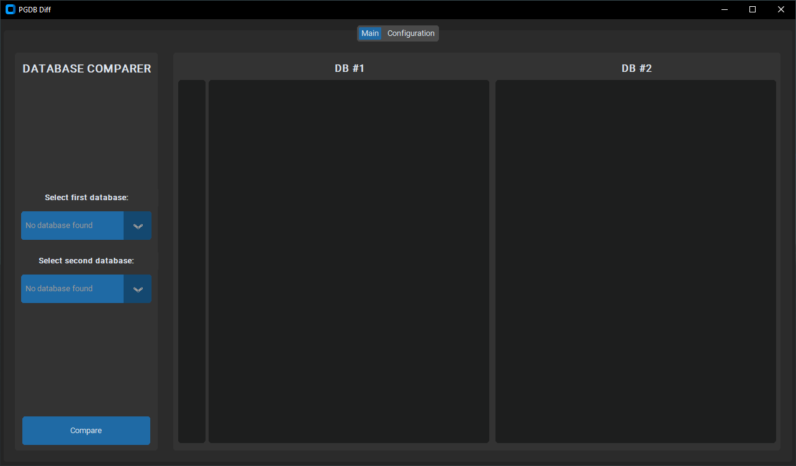

# PGDB Diff

Utility to compare two [PostgreSQL](https://www.postgresql.org/) databases.<br>
The application uses [difflib](https://docs.python.org/3/library/difflib.html) to perform the comparison, and `pg_dump` to get the SQL declaration of the tables.<br>
First, a simple comparison of table names on both databases is performed by selecting all the tables from each database from information schema. Then, `pg_dump` is used on the tables exclusive to each database, to get their SQL declarations.<br>
The application stores it's configurations on the `CONFIG.ini` file, created on startup if it doesn't exist, as a copy of [CONFIG.ini.example](./CONFIG.ini.example).

## Overview



## Create virtual environment

You can create a python virtual environment to run the application with the command `python -m venv .venv`, from the project root directory.
You can then start it with:

- Windows: `.venv/Scripts/Activate.ps1` or `.venv/Scripts/activate.bat`
- Linux: `.venv/bin/activate.sh` or `.venv/bin/activate.fish`
  It can be disabled with `deactivate`. More info about venv in https://docs.python.org/3/library/venv.html.

## Requirements

At least python `3.10.11` is recommended. Package requirements can be installed from [requirements.txt](requirements.txt) with:

```
    pip install -r requirements.txt
```

## Run the application

### Windows

- Use native `.exe` executable compiled with [pyinstaller](https://pyinstaller.org/en/stable/), avaiable on releases.
- Run [run.bat](./run.bat).
- Run [main.pyw](./src/main.pyw) with python.

### Linux/Mac

- Use native binary compiled with [pyinstaller](https://pyinstaller.org/en/stable/), avaiable on releases (only for linux).
- Run [run.sh](./run.sh) (can be made into an executable with `chmod u+x run.sh`).
- Run [main.pyw](./src/main.pyw) with python (can be made into an executable with `chmod u+x src/main.pyw`).

## Compile

The application can be compiled with [pyinstaller](https://pyinstaller.org/en/stable/) with:

```
    pyinstaller --clean --onefile ./src/main.pyw --noconsole
```

The application will be compiled to `dist/` directory. It's necessary to copy [CONFIG.ini.example](./CONFIG.ini.example) to the folder containing the compiled executable.
